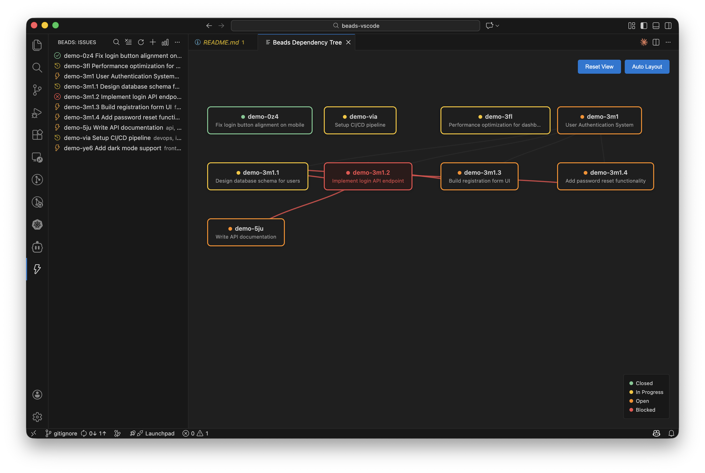

# Beads VS Code Extension



This Visual Studio Code extension provides a simple explorer view for [Beads](https://github.com/steveyegge/beads) projects so that you can manage your beads without leaving the editor.

## Features

- **Dedicated Activity Bar**: Beads has its own dedicated view in the VS Code activity bar for easy access.
- **Tree View**: Explorer view that lists all beads for the current workspace with status-based icons.
- **Live Data Sync**: Automatically watches the Beads database for changes and refreshes the view in real-time.
- **Search**: Search across beads by ID, title, description, labels, status, assignee, and more.
- **Drag and Drop Sorting**: Manually reorder beads in the tree view with drag-and-drop support.
- **Dependency Visualization**: Interactive dependency graph showing relationships between beads with draggable nodes.
- **Rich Bead Details**: Click any bead to view a detailed panel with:
  - Full description, design notes, and acceptance criteria
  - Status, priority, issue type, and timestamps
  - Labels with quick add/remove functionality
  - External reference tracking
  - Dependency information
- **Inline Editing**: Edit bead status and labels directly from the detail view.
- **Quick Label Management**:
  - Add/remove custom labels
  - Quick "In Review" toggle button
- **Clickable URLs**: URLs in bead descriptions and notes are automatically converted to clickable links.
- **Delete Beads**: Remove beads with keyboard shortcuts (`Cmd+Backspace` on Mac, `Delete` on Windows/Linux) or via context menu.
- **CLI Integration**: Create new beads directly from VS Code using the `bd` CLI.
- **Natural Sorting**: Beads are sorted naturally by ID (handles numeric parts correctly).

The extension integrates with the Beads CLI (`bd`) and reads from the Beads database (`.beads/*.db`). Changes are automatically reflected in the UI through file system watchers.

## Commands

| Command | Description |
| --- | --- |
| `Beads: Refresh` | Manually reload bead data from the database. |
| `Beads: Search` | Search beads by ID, title, description, labels, status, and more. |
| `Beads: Clear Search` | Clear the current search filter and show all beads. |
| `Beads: Open` | Open a detailed view panel for the selected bead with full information and editing capabilities. |
| `Beads: Edit External Reference` | Update the external reference identifier stored for the bead. |
| `Beads: Create` | Create a new bead by prompting for a title and invoking `bd create`. |
| `Beads: Visualize Dependencies` | Open an interactive dependency graph showing relationships between beads. |
| `Beads: Clear Manual Sort Order` | Reset manual drag-and-drop sorting and return to natural ID-based sorting. |
| `Beads: Delete` | Delete selected bead(s) from the project. |

## Keyboard Shortcuts

| Shortcut | Platform | Action |
| --- | --- | --- |
| `Cmd+Backspace` | macOS | Delete selected bead(s) |
| `Delete` | Windows/Linux | Delete selected bead(s) |
| `Backspace` | All | Delete selected bead(s) (when tree view is focused) |

## Settings

- `beads.commandPath`: Path to the Beads CLI executable. Defaults to `bd`.
- `beads.projectRoot`: Optional override for the working directory used when invoking the CLI or resolving relative data file paths.
- `beads.dataFile`: Path to the Beads data file. Defaults to `.beads/issues.jsonl` (supports both JSONL and JSON formats).

## How to Use

### Basic Workflow

1. **View Beads**: Click the Beads icon in the activity bar to see all your issues
2. **Search**: Click the search icon to filter beads by any field
3. **View Details**: Click any bead to open a detailed view with full information
4. **Edit Status/Labels**: Click "Edit" in the detail view to modify status and labels
5. **Visualize**: Click the graph icon to see dependency relationships
6. **Reorder**: Drag and drop beads to customize the order (persisted per workspace)

### Status Icons

- 🟢 **Green checkmark**: Closed
- 🟡 **Yellow clock**: In Progress
- 🔴 **Red error**: Blocked
- 🔵 **Blue circle**: Open

## Development

Install dependencies and compile the extension:

```bash
npm install
npm run compile
```

### Testing

Run the test suite:

```bash
# Run unit tests (default, fast, no VSCode required)
npm test

# Run integration tests (requires VSCode, may not work on all macOS versions)
npm run test:integration

# Run linter
npm run lint
```

See [TESTING.md](TESTING.md) for more information about the test infrastructure.

### Running the Extension

Launch the extension using the **Run > Start Debugging** command in VS Code. This will open a new Extension Development Host window with the Beads explorer view.

## Contributing

Contributions are welcome! Please see [CONTRIBUTING.md](CONTRIBUTING.md) for guidelines.

## Distribution

See [DISTRIBUTION.md](DISTRIBUTION.md) for information on:
- Publishing to VS Code Marketplace
- Creating GitHub releases
- Local installation methods
- Setting up continuous deployment

## License

This project is licensed under the MIT License - see the [LICENSE](LICENSE) file for details.

## Resources

- [Beads CLI](https://github.com/steveyegge/beads) - The core Beads project management tool
- [VS Code Extension API](https://code.visualstudio.com/api) - For contributing to this extension
